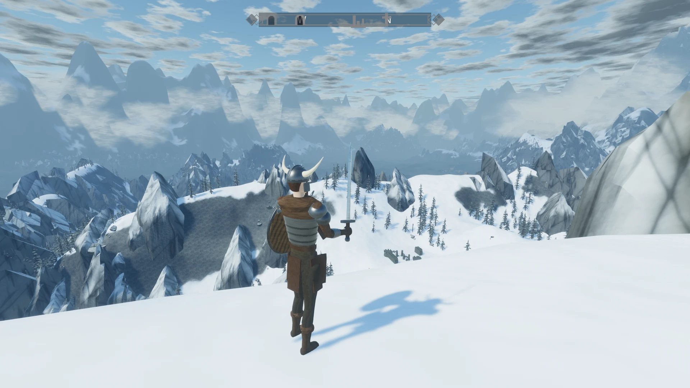

# The Vibe Scrolls V: Clauderim

**Play in the browser: https://peachpearorange.github.io/clauderim/** (needs WebGPU — Chrome or Edge; click for fullscreen)

A procedural Nordic wilderness in Bevy: a horned-helmet Dragonborn, wolves, draugr, bandits, barrows, a word wall and a dragon. No mesh or texture assets — everything is generated.

Run locally with `cargo run`.
